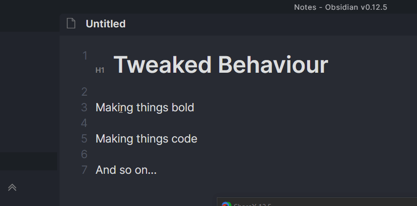

# ObsidianTweaks

This is a small plugin that implements some features of Obsidian that I believe
should've been part of the core release -- perhaps in the future they will be? ❤️

## Installation

In the future I hope ObsidianTweaks will be added to the Community Repository of plugins and be installable directly in Obsidian.

Until then manual installation is required:

1. Download the latest main.js & mainfest.json from releases.
2. Create a new folder named 'obsidian-tweaks'
3. Place the files in the folder
4. Place the folder in your .obsidian/plugins directory
5. Reload plugins (easiest way is just restarting Obsidian)
6. Activate the plugin as normal.

## Features

Below is a list of the current functionality that has been implemented.

Note that hotkeys cannot be 'disabled', but they can be set to <kbd>Blank</kbd>.
They are all set to <kbd>Blank</kbd> by default.

### Commands
| Recommended hotkey | Action |
| --- | --- |
| <kbd>Alt</kbd> + <kbd>←</kbd> | Move Selection Left |
| <kbd>Alt</kbd> + <kbd>→</kbd> | Move Selection Right |
| <kbd>Blank</kbd> | Better Toggle Bold (asterisks) |
| <kbd>Ctrl</kbd> + <kbd>B</kbd> | Better Toggle Bold (underscores) |
| <kbd>Blank</kbd> | Better Toggle Italics (asterisks) |
| <kbd>Ctrl</kbd> + <kbd>I</kbd> | Better Toggle Italics (underscores) |
| <kbd>Blank</kbd> | Better Toggle Code |
| <kbd>Ctrl</kbd> + <kbd>/</kbd> | Better Toggle Comment |
| <kbd>Blank</kbd> | Better Toggle Highlight |
| <kbd>Blank</kbd> | Better Toggle Strikethrough |
| <kbd>Ctrl</kbd> + <kbd>Shift</kbd> + <kbd>A</kbd> | Select Current Line(s) |
| <kbd>Shift</kbd> + <kbd>Alt</kbd> + <kbd>↑</kbd> | Copy Current Line(s) Up |
| <kbd>Shift</kbd> + <kbd>Alt</kbd> + <kbd>↓</kbd> | Copy Current Line(s) Down |
| <kbd>Shift</kbd> + <kbd>Alt</kbd> + <kbd>←</kbd> | Copy Current Line(s) Left |
| <kbd>Shift</kbd> + <kbd>Alt</kbd> + <kbd>→</kbd> | Copy Current Line(s) Right |
| <kbd>Ctrl</kbd> + <kbd>Alt</kbd> + <kbd>1</kbd> | Toggle Heading - H1 |
| <kbd>Ctrl</kbd> + <kbd>Alt</kbd> + <kbd>2</kbd> | Toggle Heading - H2 |
| <kbd>Ctrl</kbd> + <kbd>Alt</kbd> + <kbd>3</kbd> | Toggle Heading - H3 |
| <kbd>Ctrl</kbd> + <kbd>Alt</kbd> + <kbd>4</kbd> | Toggle Heading - H4 |
| <kbd>Ctrl</kbd> + <kbd>Alt</kbd> + <kbd>5</kbd> | Toggle Heading - H5 |
| <kbd>Ctrl</kbd> + <kbd>Alt</kbd> + <kbd>6</kbd> | Toggle Heading - H6 |

### Move selection

Move selection does not support going across lines. This seems unnecessary and
is really messy to implement.
### Better Toggles

The default toggles in Obsidian can be a bit wonky at times and do not always
work well. The toggles implemented here should always return to the
same state when toggled twice.

They also do nice word-wrapping for you.

Additionally __Bold__ and _Italics_ are implemented with underscores as well
as asterisks. Simply bind the command you want.

Math toggles are also included.

## Philosophy

- By default no features are enabled. You can enable the features you want.
  - Thus all features can also be disabled.
- All code is released into public domain without any requirement for attribution using the [Unlicense](https://unlicense.org/).

## Why Unlicense?

In case the developers of Obsidian want to just straight copy some code into Obsidian, they can do that without worrying about licensing at all.

**Note that any contributions to ObsidianTweaks will thus also be Unlicensed.**

## Honorable Mentions

I initally planned to contribute to the [Hotkeys++](https://github.com/argenos/hotkeysplus-obsidian) plugin, but since I don't necessarily want ObsidianTweaks to be limited to hotkeys in the future, I decided to make my own.

## Contributors

- [Jeppe Klitgaard](https://github.com/JeppeKlitgaard)
